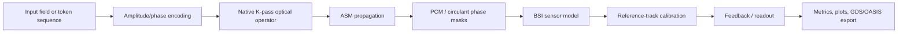

# Spatial Diffraction Fields
## Behavioral Digital Twin for Photonic AI Hardware

**Release:** `engineering_scaffold v0.3`  
**Status:** Research prototype / hybrid photonic-emulation benchmark  
**License and PDK status:** No proprietary PDK, foundry rule deck, credential, or confidential material is included.

---

## Executive Summary

Spatial Diffraction Fields is a PyTorch-based behavioral Digital Twin for a multilayer diffractive photonic processor. It combines scalar Angular Spectrum Method (ASM) propagation, phase-change-material-inspired masks, WDM tensor execution, differentiable native circulant operators, noise-aware training, closed-loop reference calibration, topology export, and reproducible engineering reports.

The project is designed to support early hardware/software co-design before access to a foundry PDK or fabricated silicon.

> The current release demonstrates algorithmic and architectural feasibility. It does not claim fabricated optical MAC hardware, foundry sign-off, measured TOPS/W, or production yield.

---

## System Architecture



### Main components

| Component | Function |
|---|---|
| ASM core | FFT-based scalar wave propagation |
| Material model | Complex refractive-index scaffold with absorption |
| WDM path | Independent `[batch, channels, H, W]` field tensors |
| Native optical operator | Trainable K-pass circulant-diagonal Fourier operator |
| Noise-aware training | Quantization, wavelength drift, thermal crosstalk, dropout |
| Calibration | Reference interference gain/phase correction |
| Tape-out geometry | GDSII/OASIS geometry generation with pre-DRC checks |
| Validation | Physics, topology, PVT, and software regression tests |

---

## Demonstrated Results

### Native circulant training

The native operator is trained directly in its K-pass optical parameterization rather than factorized after training.

| Model | K | Validation PPL | Interpretation |
|---|---:|---:|---|
| Character-level MicroGPT, `d_model=32` | 2 | 86.868 | Feasibility signal on a small held-out corpus |
| Character-level MicroGPT, `d_model=64` | 2 | 351.354 | Requires a larger corpus and further regularization |

The corpus is intentionally small and character-level. These values are not natural-language benchmark claims.

### PVT and calibration

Full simulated PVT sweep:

- Temperature: `-10 C ... +10 C`
- VCSEL power: `-5% ... +5%`
- Samples: `1000`

| Metric | Result |
|---|---:|
| Raw maximum relative output error | `5.378%` |
| Raw 95th percentile error | `4.858%` |
| Calibrated reference residual, maximum | `0.174%` |
| Calibrated reference residual, 95th percentile | `0.167%` |
| Raw PVT status | `REVIEW` |

Closed-loop calibration reduces scalar gain/phase drift in simulation. It does not replace spatial calibration of a fabricated device.

### Calibration overhead

| Mode | Additional detector area | Average power overhead | Timing overhead |
|---|---:|---:|---:|
| Dedicated parallel tracks | `200%` | `200%` | `0%` |
| Sparse 4-pixel reference grid | `6.25%` | `6.25%` | `0%` |
| TDM reference reuse | `0%` | `2%` | `1% / 10 ns` |

These are engineering estimates based on explicit assumptions, not measured silicon data.

### Topology output

The K=2 assembly includes:

- two phase-mask blocks;
- input/output grating geometry;
- BSI sensor grid;
- GDSII export;
- minimum-feature pre-check at `100 nm`.

Verified assembly bounding box:

```text
27 um x 16 um
202 polygons
```

The layout uses `generic_scaffold` layers and is not a foundry-ready mask.

---

## Reproducibility

The release package contains:

- source modules;
- test suite;
- PVT and calibration reports;
- native training metrics;
- topology artifacts;
- SHA-256 manifest;
- CUDA requirements file.

Validation status:

```text
26 tests: PASS
compileall: PASS
CUDA runtime: NVIDIA RTX 5070 Ti / PyTorch cu128
foundry_ready: false
raw PVT: REVIEW
```

Typical commands:

```powershell
python -m unittest discover -s tests -v
python native_circulant_benchmark.py
python pvt_analysis.py
python calibration_overhead.py
python release_package.py
```

---

## Scientific Scope

### Supported claims

- scalar ASM propagation;
- differentiable native K-pass optical operator;
- hybrid photonic-emulation benchmark;
- simulated noise-aware training;
- simulated closed-loop scalar calibration;
- generic GDSII/OASIS geometry export;
- reproducible software and artifact integrity checks.

### Explicitly out of scope for this release

- fabricated optical NPU performance;
- measured TOPS/W or energy efficiency;
- foundry DRC/LVS sign-off;
- proprietary PDK layer mapping;
- full-wave FDTD validation;
- calibrated BSI/ROIC electrical behavior;
- production yield or silicon qualification.

---

## Post-PDK Roadmap

1. Full-wave validation of grating couplers, splitters, PCM transitions, and critical optical cells.
2. PDK-specific layer mapping, DRC/LVS, process corners, etch bias, and line-edge roughness.
3. Coupled transient thermal simulation with data-dependent hotspots and measured boundary conditions.
4. BSI/ROIC model including ADC INL/DNL, TIA behavior, settling, offset, dark current, and crosstalk.
5. Multi-seed validation on a larger public language corpus.

See [POST_PDK_ROADMAP.md](POST_PDK_ROADMAP.md) and [PUBLICATION_AUDIT.md](PUBLICATION_AUDIT.md) for the detailed qualification plan.

---

## Data Room Artifacts

- [Release manifest](outputs/release_engineering_scaffold_v0.3/RELEASE_MANIFEST.json)
- [Native training report](outputs/native_circulant/REPORT.md)
- [PVT metrics](outputs/pvt_k2_full/metrics.json)
- [Calibration overhead comparison](outputs/pvt_k2_full/calibration_overhead_comparison.json)
- [K=2 tape-out assembly](outputs/native_circulant/native_k2_tapeout_assembly.gds)
- [Publication audit](PUBLICATION_AUDIT.md)
- [Post-PDK roadmap](POST_PDK_ROADMAP.md)

All paths above are repository-relative. No local machine paths, credentials, proprietary PDK files, or confidential vendor data are required.

---

## Investor and Partner Disclosure

This repository is an open research communication artifact. Numerical results are reproducible simulation outputs under the stated assumptions. Any transition to a fabrication claim requires an approved PDK, foundry design rules, full-wave electromagnetic validation, transient thermal analysis, ROIC characterization, and measured silicon data.
